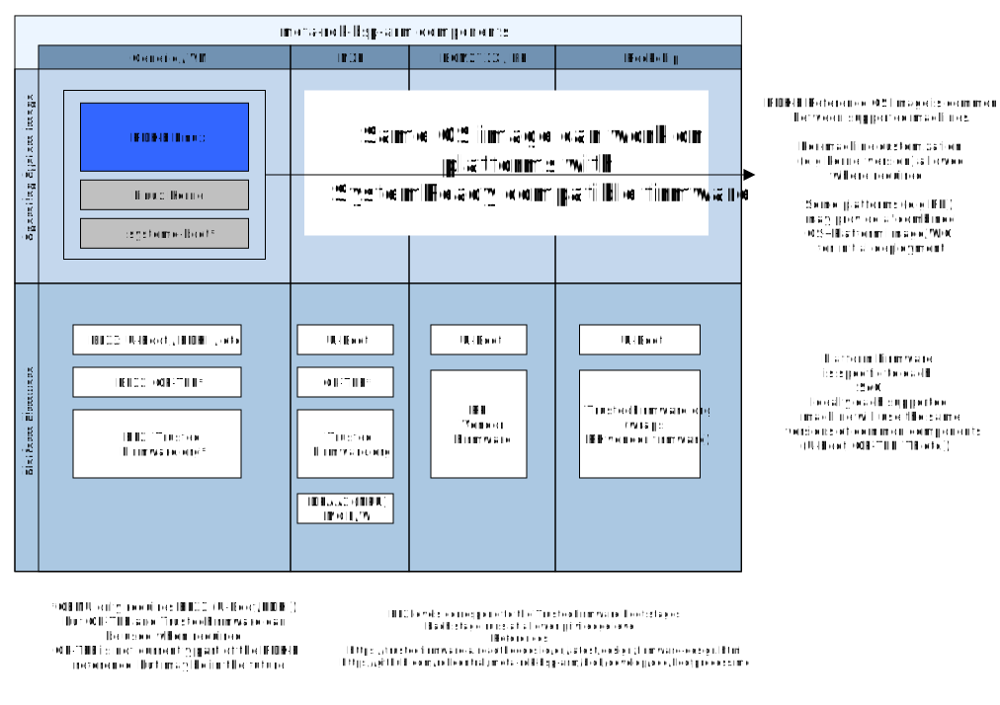

# RDK-B Reference Layer for Arm


This meta layer provides the components to support RDK-B 
platform on  [Arm SystemReady](https://www.arm.com/architecture/system-architectures/systemready-certification-program) compatible machines, including common virtual machine applications. 
Additionally, the same image functions (on a "best-effort" support basis) on hardware compatible with the
specifications. This layer only sources from community upstream sources (e.g kernel.org) and does not use any vendor-specific SDKs.

## How to use

There are some RDK-B packages for which custom branches are needed, so you will need to use
our `rdkb-bsp-arm.xml` manifest.

```
$ mkdir rdkb-arm
$ cd rdkb-arm
$ repo init -u 'https://github.com/rdkcentral/meta-rdk-bsp-arm/' \
    -m "manifests/rdkb-bsp-arm.xml" \
    -b "main"
$ repo sync
$ source meta-rdk-bsp-arm/setup-environment
$ bitbake rdk-generic-broadband-image
```

If you need to enable features such as unified-wifi-mesh/EasyMesh, you can do this
by creating the `conf/distro/include/local-settings.inc` file, like so:

```
echo 'DISTRO_FEATURES:append:broadband = " EasyMesh"' >> conf/distro/include/local-settings.inc
echo 'DISTRO_FEATURES:append:broadband = " with_alsap"' >> conf/distro/include/local-settings.inc
```

At the current time, the `main` branch mainfest will build RDK-B 2025Q1 (based on Yocto `kirkstone`),
and will be updated following the next major RDK-B release.

The `develop` branch is intended to follow `rdk-next` as closely as possible.

Some Linux distributions with AppArmor support (such as Ubuntu 24.04)
may experience difficulties when building meta-rdk-bsp-arm,
for best results a Debian 12 environment is recommended.

Please see the ["Reference Build Environment"](https://github.com/rdkcentral/meta-rdk-bsp-arm/wiki/Reference-Build-Enviroment)
page for more information.

## Build outputs



There are two types of build outputs:

* The _platform firmware_, which abstracts the hardware platform in a standard manner (the SystemReady standards).

* The _operating system image_, which includes the root filesystem, Linux kernel and boot manager.
  
  Development images generated by this layer can be used across any machine which has a compatible _platform firmware_ deployed.

The default `armefi64-rdk-broadband` machine type will generate an _operating system image_
that will be bootable on platforms with SystemReady (EFI) compatible firmware **and** a
_platform firmware_ firmware which can be used with QEMU's arm64 
[`virt`](https://qemu-project.gitlab.io/qemu/system/arm/virt.html) machine type.

The following generated binaries (in `build-armefi64-rdk-broadband/tmp/deploy/images/armefi64-rdk-broadband/`) are relevant:

* `rdk-generic-broadband-image-armefi64-rdk-broadband.wic`: Uncompressed operating system image (kernel + rootfs + boot manager)
  
  This image can be booted on a board (or virtual machine) which already has SystemReady compatible firmware
* `rdk-generic-broadband-image-armefi64-rdk-broadband.wic.qcow2`: QCOW2 operating system image, best to use with virtual machine programs
* `rdk-generic-broadband-image-armefi64-rdk-broadband.tar.gz`: Compressed tar archive of the operating system image (including kernel). This is currently used for system upgrades.
* `u-boot-armefi64-rdk-broadband.bin` (linked to `u-boot.bin`): Reference _platform firmware_ (used with QEMU `virt` machine)

The generated disk (wic) images are intended for block storage devices, for example,
eMMC, SD cards, USB or NVMe storage devices, or emulated types such as `virtio-blk`.

A production device may use flash (NOR or NAND) devices for storing the system level firmware.

Additional files like `Image` (Linux kernel Image file), `linuxaa64.efi.stub` (Kernel EFI stub),
`systemd-bootaa64.efi` (systemd-boot executable) and `u-boot-initial-env-armefi64-rdk-broadband`
(U-Boot "Factory" environment) are also generated by the Yocto build process.
These are not needed for normal development and deployment activities.

It is intended that the `rdk-generic-broadband-image-armefi64-rdk-broadband.wic` is a _universal_
operating system image that will boot on as many real and virtual machines as possible.

(For example, you can write the `.wic` file onto a USB drive, and move the USB
drive between different boards without making any changes)

Where possible, the same Linux kernel, firmware (U-Boot) and other relevant
component versions will be used, with a strong preference for "mainline" versions.

For further information, see ["Real Hardware"](#real-hardware) and
["Development Notes"](#development-notes) at the bottom of this document, and
the ["Boot Process for generic Arm systems"](doc/bootprocess.md) note.

## Building platform firmware for different hardware types

Many development boards will not have a SystemReady-compatible firmware pre-loaded,
or the pre-loaded firmware will be out of date.

To provide an easier developer experience, this meta-layer can build the platform
firmware for several common developer boards.

Once you have deployed the SystemReady-compatible _platform firmware_ to your board,
you will not need to replace it and only need to consider updating your
_operating system image_.

This meta layer can generate firmware for the following types of hardware,
with more planned to be implemented (see Wiki [Hardware Support Table](https://github.com/rdkcentral/meta-rdk-bsp-arm/wiki/Hardware-Support-Table)).

Board Name              | `MACHINE` identifier          | multiconfig nickname  |
------------------------|-------------------------------|-----------------------|
Generic QEMU            | `armefi64-rdk-broadband`      | `generic`             |
Raspberry Pi 3/4 64-bit | `raspberrypi64-rdk-broadband` | `raspberrypi`         |

The default `MACHINE` is `armefi64-rdk-broadband` (as explained above).

To generate an image for another machine, specify the `MACHINE` environment
variable when sourcing `setup-environment`:

```
MACHINE="raspberrypi64-rdk-broadband" source meta-rdk-bsp-arm/setup-environment
```

All machine configurations for RDK-B inherit from `armefi64-rdk-broadband`.

Unless the machine configuration has specific overrides, the operating system image
(kernel + rootfs + boot manager) generated by configurations like `raspberrypi64-rdk-broadband`
will be identical to that of the generic machine. **Only the _platform_ firmware binaries will be different**.

### Configuring multiconfig for multiple target builds

It is possible to use BitBake's ["multiconfig"](https://docs.yoctoproject.org/5.0.9/dev-manual/building.html#building-images-for-multiple-targets-using-multiple-configurations)
feature to setup the same build folder for multiple targets at once.

Doing so will save you time and disk space, as most packages between
machines defined in this layer are shared.

If you specify `MACHINE=all`, the `setup-environment` script will do the necessary setup:

```
$ MACHINE="all" source meta-rdk-bsp-arm/setup-environment
```

You can then run the build cycle for each target:

```
$ bitbake mc:generic:rdk-generic-broadband-image && \
    bitbake mc:raspberrypi:rdk-generic-broadband-image
```

(Due to the way RDK-B components are built, it is not possible to do
a "parallel" build for two targets at once, however, you will still
save a significant amount of time and disk space by using multiconfig
builds sequentially)

Build images for each target will be available in `tmp/deploy`:

```
$ ls build-armefi64-rdk-broadband/tmp/deploy/images/
armefi64-rdk-broadband
raspberrypi64-rdk-broadband
```

## Usage Notes

* This layer is configured to use WanManager exclusively.

  There is no `erouter0` interface.
  Some components that do not function without `erouter0`, like WebUI,
  are not currently included.

* The WAN interface will be mapped to `eth6`. LAN side will always be on `eth0`.

  If a second WAN interface (like SFP) exists, it will be mapped to `eth8`.

  This is to keep the interface names consistent between all hardware devices
  until it is possible to do this configuration at runtime.

  The mapping of Ethernet interfaces is performed in `/lib/rdk/ethwan_intf.sh`.

### SSIDs, Passwords and other configuration settings

WiFi SSIDs will be setup with the following settings:

```
phy#1
        Interface wlan1
                ifindex 22
                wdev 0x100000001
                addr 00:0a:52:08:34:c5
                ssid RDKB-AP1
                type AP
                channel 44 (5220 MHz), width: 80 MHz, center1: 5210 MHz
                txpower 23.00 dBm
phy#0
        Interface wlan0
                ifindex 21
                wdev 0x1
                addr 00:0a:52:08:34:c4
                ssid RDKB-AP0
                type AP
                channel 1 (2412 MHz), width: 20 MHz, center1: 2412 MHz
                txpower 17.00 dBm
```

These correspond to the `private_ssid_` configurations in RDK-B's WiFi configuration.
Other WiFi SSIDs (such as IoT and Hotspot) are currently disabled due to a driver issue.

The default WiFi passwords are sourced from `/nvram/wifi_defaults.txt` (sourced from
`meta-rdk-broadband/recipes-ccsp/ccsp/files/wifi_defaults.txt` inside this repository).

You can change the WiFi password with these dmcli commands:

```
dmcli eRT setv Device.WiFi.AccessPoint.1.Security.KeyPassphrase string 'new_wifi_password'
dmcli eRT setv Device.WiFi.AccessPoint.2.Security.KeyPassphrase string 'new_wifi_password'
dmcli eRT setv Device.WiFi.ApplyAccessPointSettings bool true true
```

In the future there will be a standardized method to derive/source 'default' WiFi credentials
on supported devices.

To use a cellular modem, you will need to set `dmsb.cellularmanager.profile.default.apn` in the
PSM database to your operator's internet APN.

**Users of this repository should ensure all default settings (such as passwords) are changed**

No credentials outside the scope of the gateway are stored inside this repository, any references
to external services are placeholder/test values only.

# Running the generated image

## QEMU (Arm64 virtualized or emulated)

### Method 1: Yocto runqemu

The Yocto machine files are setup to boot the VM with `runqemu`.

This setup is not as flexible as other methods, but it allows quick verification
that the built image is working.

Note that you will require `sudo` access for `runqemu` to setup the networking connection
between host and guest.

```
$ runqemu nographic

matt@build:/home/matt/rdkb-cmf-arm/build-armefi64-rdk-broadband$ runqemu nographic
runqemu - INFO - Running bitbake -e ...
runqemu - INFO - Continuing with the following parameters:
MACHINE: [armefi64-rdk-broadband]
FSTYPE: [wic.qcow2]
ROOTFS: [/home/matt/rdkb-cmf-arm/build-armefi64-rdk-broadband/tmp/deploy/images/armefi64-rdk-broadband/rdkb-generic-broadband-image_rdk-next_20241029112121.rootfs.wic.qcow2]
CONFFILE: [/home/matt/rdkb-cmf-arm/build-armefi64-rdk-broadband/tmp/deploy/images/armefi64-rdk-broadband/rdkb-generic-broadband-image_rdk-next_20241029112121.qemuboot.conf]
...
U-Boot 2024.07 (Jul 01 2024 - 18:07:18 +0000)
....
EFI stub: Booting Linux Kernel...
EFI stub: Using DTB from configuration table
EFI stub: Exiting boot services...
[    0.000000] Booting Linux on physical CPU 0x0000000000 [0x410fd034]
[    0.000000] Linux version 5.15.68-yocto-standard (oe-user@oe-host) (aarch64-rdk-linux-gcc (GCC) 11.3.0, GNU ld (GNU Binutils) 2.38.20220708) #1 SMP Wed Sep 21 20:06:51 UTC 2022
...
Welcome to RDK (A Yocto Project based Distro) 2.0 (kirkstone)!
...
RDK (A Yocto Project based Distro) 2.0 armefi64-rdk-broadband ttyAMA0

armefi64-rdk-broadband login: root (automatic login)
```

Under the runqemu configuration, the LAN side interface will be available to the host
as the `tapX` interface, while the WAN interface will use QEMU's Userspace emulation.

### Method 2: Direct QEMU invocation

You can use the generated `wic.qcow2` and `u-boot.bin` to invoke QEMU directly.
This allows you to customize your QEMU setup for your own environment and requirements.

On virtualization capable Arm64 hosts you can use KVM for near-native performance.

You can invoke QEMU like this:

```
# Copy the QCOW2 image and u-boot.bin from the deploy directory
cp $HOME/rdkb-cmf-arm/build-armefi64-rdk-broadband/tmp/deploy/images/armefi64-rdk-broadband/{rdk-generic-broadband-image-armefi64-rdk-broadband.wic.qcow2,u-boot.bin} .

# It can be helpful to create a snapshot to quickly revert
# any changes that are made
qemu-img create -f qcow2 -b rdk-generic-broadband-image-armefi64-rdk-broadband.wic.qcow2 -F qcow2 rdk.snapshot.qcow2
# And resize that snapshot to allow space for upgrades
qemu-img resize rdk.snapshot.qcow2 10G

DISK=${DISK:-rdk.snapshot.qcow2}
sudo qemu-system-aarch64 -nographic \
    -cpu cortex-a53 -machine virt \
    -bios u-boot.bin \
    -smp 2 -m 1024 \
    -device virtio-rng-pci \
    -hda "${DISK}" \
    -netdev tap,id=testlan -net nic,netdev=testlan \
    -netdev tap,id=testlan2 -net nic,netdev=testlan2 \
    -netdev user,id=testwan -net nic,netdev=testwan \
    -device pci-serial
#using bridge manager:
# ensure /usr/local/libexec/qemu-bridge-helper is present and executable
# provide /usr/local/etc/qemu/bridge.conf:
#     allow br10
#     allow br100

sudo qemu-system-aarch64 -nographic \
    -cpu cortex-a53 -machine virt \
    -bios u-boot.bin  \
    -smp 2 -m 1024  \
    -device virtio-rng-pci  \
    -hda "${DISK}"  \
    -netdev bridge,id=testwan,br=br10 \
    -device virtio-net pci,netdev=testwan,mac=52:54:00:2d:6e:99  \
    -netdev bridge,id=testlan,br=br100 \
    -device virtio-net-pci,netdev=testlan,mac=52:54:00:2d:6e:98  \
    -device pci-serial
```

On native Arm64 platforms with virtualization, enable KVM by replacing `-cpu cortex-a53` with `-cpu host --enable-kvm`.

### QEMU frontends (UTM.app, virt-manager etc.)
See the [doc/virtualization](doc/virtualization) folder for information on using various QEMU frontend programs (like UTM.app and virt-manager).

## Real hardware
A benefit of the SystemReady architecture is being able to use the same images
on virtual machines and bare-metal hardware.

Note that images generated by this reference layer SHOULD boot on SystemReady compatible
hardware, but hardware and vendor specific features like LED configurations, hardware
dataplanes and SoC-specific WiFi integrations are not included in this layer.

This layer also only generates the board-level firmware for the QEMU reference machine,
while downstream layers should be used to generate the equivalent board firmware.

Just like the VM images, you can write the `wic` image directly to your boot device.

# Development Notes

This layer is self-contained, it does not depend on any other layers for board support, however,
`meta-arm` (https://git.yoctoproject.org/meta-arm) has been used as the model for the firmware, QEMU
and machine setup.

For development purposes, there is both a "core" image type and a RDK-B image type:

* `armefi64`
   This is the "base" machine type that serves as a base. It does not import any RDK packages or
   configuration. When updating to newer Yocto project versions, use this
   machine for the initial porting (with Yocto image types like `core-image-minimal`).

* `armefi64-rdk-broadband`
   This is the RDK-B reference machine which inherits from `armefi64`

When adding another machine to the layer, it should inherit from `armefi64-rdk-broadband`.
