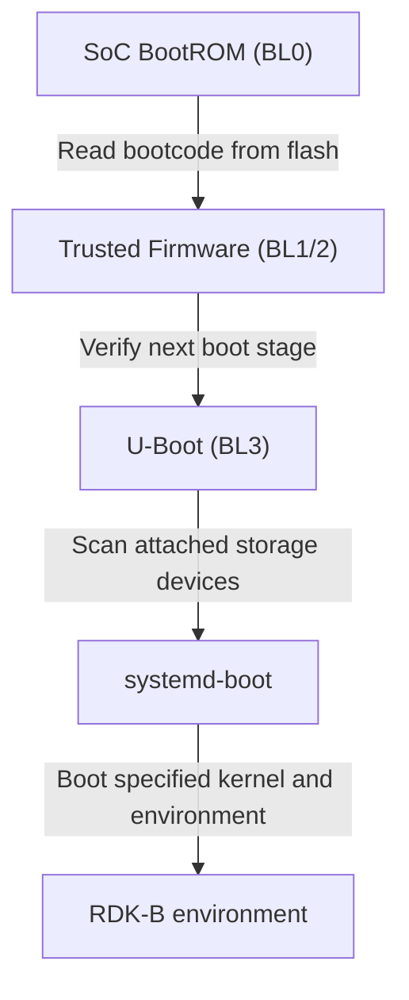

# Boot Process for generic Arm systems

The generic Arm port of RDK-B follows the Arm [SystemReady](https://www.arm.com/architecture/system-architectures/systemready-compliance-program) specification.

## Benefits

* Leverage the recent significant investment in the Arm firmware ecosystem by
  industry participants.

* Use proven specifications and standards for platform security (Secure Boot)

* Faster bring up of RDK-B on new platforms

* System images are portable from embedded boards to
  common hypervisor packages and cloud environments

## Boot Process

A full RDK-B system will typically use these components:

* [Arm Trusted Firmware](https://github.com/ARM-software/arm-trusted-firmware) ("TF-A") as the
  secure world ("TrustZone") firmware and low level platform setup.

  On systems with the Arm Standard firmware update mechanism (FWU), TF-A is responsible for authenticating
  and updating low level system firmware.

* [U-Boot](https://docs.u-boot.org/en/latest/) as the boot firmware and EFI service provider

  RDK-B will also interoperate with other firmwares like [EDKII](https://github.com/tianocore/edk2) for use cases 
  such as virtual machines.

  This BSP layer provides a reference version of U-Boot which can be derived by downstream
  consumers.

* [systemd-boot](https://www.freedesktop.org/wiki/Software/systemd/systemd-boot/) as EFI boot loader

  systemd-boot provides boot time selection between different images/environments (for "A/B" boot management).
  
  It may be possible to avoid systemd-boot (and boot into the kernel directly) by using EFI functions (such as BootOrder variables)
  on platforms with a full feature set.

### References

* [Arm Trusted Firmware boot process](https://trustedfirmware-a.readthedocs.io/en/latest/components/firmware-update.html#firmware-update-fwu)

* [Embedded Base Boot Requirements (EBBR)](https://arm-software.github.io/ebbr/)

