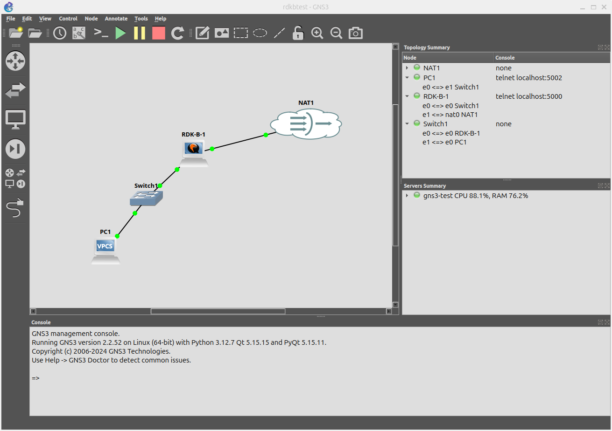
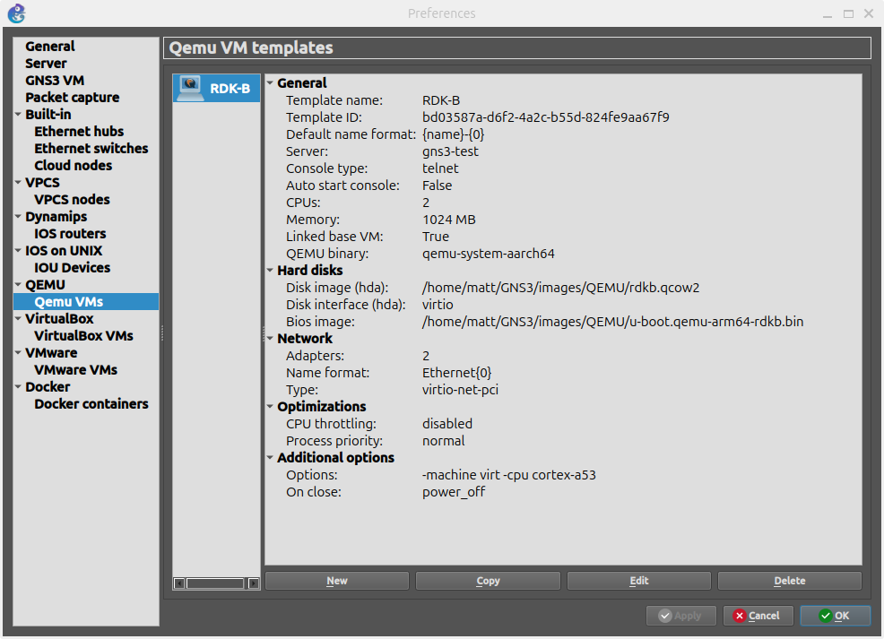

# Using RDK-B Arm images with the GNS3 network simulator

## Requirements

### System Level

* At this time, this setup has only been tested on Linux (specifically, Ubuntu 'ocular' 24.10)

* GNS3 installed as per the standard [install method](https://docs.gns3.com/docs/getting-started/installation/linux)
    * You will need to setup GNS3 to _Run appliances on my local computer_ (do not use the GNS3 VM option).

* qemu-system-aarch64 installed on the host system

* Emulating machines of a different architecture (like Arm on x86) is a computationally intensive task.

  Ideally you have a native Arm machine that has virtualization capabilities, or a fast x86 machine 
  (>=2023 '7' or '9' type desktop/workstation processor).

### Build level

* `u-boot.bin` for the QEMU virt machine (`u-boot-armefi64-rdk-broadband.bin` in the meta-rdk-bsp-arm deploy dir)
* QCOW2 disk image (`rdk-generic-broadband-image-armefi64-rdk-broadband.wic.qcow2`)

## Quick Summary of settings in template

| Setting      | Value                         |
|--------------|-------------------------------|
| Template Category | Routers                  |
| QEMU binary  | /usr/bin/qemu-system-aarch64* |
| Console type | Telnet                        |
| RAM          | At least 1024MB               |
| vCPUs        | At least 1, ideally 2         |
| HDD Disk image and interface | Use the `rdkb-generic-broadband-image-armefi64*.wic.qcow2` image, with virtio interface |
| Network Adapters | At least 2, with type `virtio-net-pci` |
| BIOS Image | Use `u-boot-armefi64-rdk-broadband.bin` generated by the RDK-B build `
| Additional \[QEMU\] settings | `-machine virt -cpu cortex-a53` |

On an x86 host system, disable the _Require hardware acceleration (KVM/HAXM)_ under
Preferences->QEMU to allow QEMU to work in emulation mode.

\* Some systems with a unified `/bin` may show both a `/bin` and `/usr/bin` option,
it does not matter which one you select, as long as it is the `aarch64` version.

## Setup instructions

Make sure the _Require hardware acceleration (KVM/HAXM)_ is unchecked in the GNS3 QEMU preferences.
You can find this under Edit->Preferences->QEMU.

The first step is to create a template VM in GNS3 with the correct settings, then you
can drag-and-drop this template into your GNS3 lab window.

Copy `rdk-generic-broadband-image-armefi64-rdk-broadband.wic.qcow2` and `u-boot.bin`
into your GNS3 QEMU images folder.
(normally `$HOME/GNS3/images/QEMU`)

\* To avoid confusion with other u-boot binaries, you may wish to rename your `u-boot.bin`
to something unique, like `u-boot.qemu-arm64-rdkb.bin`.

It is advisable to resize the .wic.qcow2 to a larger size, to allow upgrading:

`qemu-img resize rdk-generic-broadband-image-armefi64-rdk-broadband.wic.qcow2 10G`

Under "QEMU VMs" / "Qemu VM Templates", press the "New" button to create a template
for the RDK-B instance.

See [RDKB-GNS3-guide.pdf](RDKB-GNS3-guide.pdf) for an annotated collection of the template settings.

When connecting the RDK-B router template to other nodes, `Ethernet0` is the LAN side
connection, and `Ethernet1` is the WAN side connection.